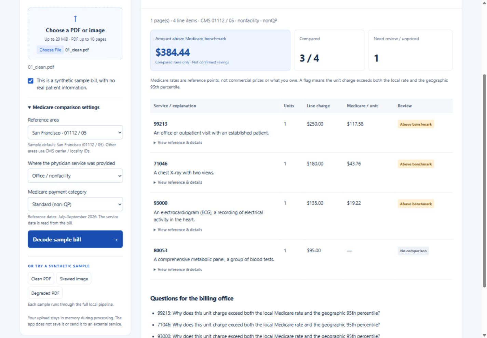

# MedBill Decoder

Understand a synthetic medical bill with local OCR, cited Medicare benchmarks, plain-language explanations and questions for the billing office. The app reports **amount above Medicare benchmark**, not confirmed overcharges or recoverable savings. No third-party runtime API, API key or LLM is required.



**Synthetic samples only; no real patient information.** The app runs on your computer, not a public hosted service. Submission materials are in the [Devpost draft](docs/DEVPOST_DRAFT.md) and [demo recording script](docs/DEMO_VIDEO_SCRIPT.md).

## What is implemented

| Stage | Actual implementation |
| --- | --- |
| OCR | PDFium rasterization, OpenCV preprocessing, local Tesseract text/coordinates/confidence |
| Parsing | Header geometry, regular expressions, explicit low-confidence review gates |
| References | pandas ingestion of pinned CMS archives; indexed, read-only SQLite runtime lookup |
| Comparison | Exact matching, Decimal unit normalization, local rate plus geographic nearest-rank p95 |
| Explanation | Seven written paraphrases plus a general local-description template; unknown codes stay unknown |
| Interface | FastAPI and plain HTML/CSS/JavaScript; no external frontend assets or browser storage |

There is no LLM-based feature. The original requested Claude fallback was removed at the project owner's direction. Codex assisted development and documentation; that is separate from the application's runtime behavior.

## Open the local app

With the setup below complete:

```powershell
.\.venv\Scripts\python.exe -m medbill.app
```

Open [MedBill Decoder](http://127.0.0.1:8000). Choose one of the three synthetic samples, or upload a synthetic PDF/image and confirm that it contains no real patient information. The page displays extracted rows, local explanations, matched benchmarks and questions for the billing office. Settings default to the sample's San Francisco reference area. The service date is read from each line; only July–September 2026 is supported.

The server listens on loopback only. It accepts raw file bytes, capped at 20 MiB, without multipart temporary-file spooling. It processes one upload at a time, uses local assets and reference data, and does not save uploaded bills or reports. See `docs/PHASE_5_WEB_APP.md` for API details, actual test results, screenshots and limits.

Blank/unreadable images and unpriced codes show **Not calculated**, not a zero-dollar estimate. Partial results identify how many rows were excluded. Changing comparison settings clears the old report. Phase 6 adds real blurred/blank/unknown-code/date regression fixtures and an observational persistence audit; its findings and limits are in `docs/PHASE_6_DEMO_POLISH.md`.

## Setup

Tested on Windows with CPython 3.12.14. Use Python 3.12 and an installed 7-Zip for automated Windows OCR extraction. Other operating systems have not been validated end to end. A fresh clone excludes the CMS archives, generated database, Python environment and Tesseract binaries.

From PowerShell (skip cloning and enter your existing project folder if already downloaded):

```powershell
git clone https://github.com/Frpratik/-MedBill-Decoder.git MedBill-Decoder
Set-Location MedBill-Decoder
py -3.12 -m venv .venv
.\.venv\Scripts\python.exe -m pip install -r requirements.txt
./scripts/setup_windows_ocr.ps1
.\.venv\Scripts\python.exe -m medbill.download_sources
.\.venv\Scripts\python.exe -m medbill.ingest
.\.venv\Scripts\python.exe -m medbill.verify
.\.venv\Scripts\python.exe -m medbill.evaluate_ocr
.\.venv\Scripts\python.exe -m unittest discover -s tests -v
.\.venv\Scripts\python.exe -m medbill.app
```

The setup-only downloader obtains five archives directly from CMS and verifies their pinned SHA-256 hashes. Existing matching files are reused; mismatches fail without replacing them. Use `python -m medbill.download_sources --check-only` to verify local archives without network access. Exact hashes are in `medbill/ingest.py`. Changed releases require review and a deliberate pin update. Initial setup needs internet access; the runtime works offline after dependencies, English OCR data and references are installed. The generated database is approximately 208 MB, with additional space needed for archives and the temporary build file. Ingestion can take several minutes.

The Windows OCR setup uses an existing 7-Zip installation to extract the pinned Tesseract release locally and downloads the official English model. Both downloads are checksum-verified. It does not run the installer or change system PATH. Alternatively, install Tesseract using the [official instructions](https://tesseract-ocr.github.io/tessdoc/Installation.html), with English traineddata, and set `TESSERACT_CMD` if the executable is not on PATH.

On the current workstation, the project-local `.venv` and `.tools/tesseract` are already configured:

```powershell
$medbillPython = '.\.venv\Scripts\python.exe'
& $medbillPython -m medbill.ingest
& $medbillPython -m medbill.verify
& $medbillPython -m unittest discover -s tests -v
```

## One lookup

```powershell
python -m medbill.reference 99213 --carrier 01112 --locality 05 --setting nonfacility --category nonQP --service-date 2026-07-15
```

For a professional component, supply `--modifier 26`. Blank modifier means the unmodified/global code; there is no fallback from an unmatched modifier to a global price. `QP` refers to the source's Qualifying APM Participant payment category, not participating/nonparticipating physician status.

The lookup requires a carrier/locality pair, setting, category, and date. It currently supports July 1–September 30, 2026. Other dates return `unsupported_date`. Facility amounts are physician-service amounts in a facility setting, not the hospital's facility charge. Published benchmarks are not insurance benefits, amounts owed, coverage determinations, or proof of an overcharge.

## OCR and parsing

```powershell
.\.venv\Scripts\python.exe -m medbill.ocr output/pdf/01_clean.pdf --synthetic
.\.venv\Scripts\python.exe -m medbill.evaluate_ocr
```

Only synthetic/public sample data is permitted. Every PDF is rasterized before local OCR; no text-layer shortcut or vision API is used. OpenCV denoises, deskews, thresholds and removes table rules. Tesseract returns word coordinates/confidence. Parsing preserves uncertain raw values and withholds low-confidence critical fields. The runtime passes images through stdin/stdout without writing temporary bill files.

Three synthetic fixtures and their generator are included. `samples/README.md` cites the bill-format references. `docs/PHASE_2_OCR_PARSING.md` records actual extraction results and failures: 13 candidate rows, eight complete and five requiring review, including two correct fields withheld by the conservative confidence policy. This is a small development regression, not a general OCR accuracy estimate. Handwriting, complex/wrapped layouts and severe camera distortion remain unvalidated.

## Benchmark comparison

```powershell
.\.venv\Scripts\python.exe -m medbill.evaluate_comparison
.\.venv\Scripts\python.exe -m medbill.compare docs/phase2/01_clean.json --synthetic --carrier 01112 --locality 05 --setting nonfacility --category nonQP
```

Only complete, accepted OCR rows with usable active CMS references are compared. The engine normalizes the line charge by quantity and flags it only when the unit charge exceeds both the matched local rate and the nearest-rank 95th percentile across matching Medicare localities. Cohorts with fewer than 20 eligible observations or no geographic variation receive no statistical flag. Uncertain and unpriced rows remain excluded. Reported amounts are partial benchmark differences, not confirmed overcharges or recoverable savings. See `docs/PHASE_3_BENCHMARK_COMPARISON.md` for formulas, actual numbers and limitations.

## Local explanations

```powershell
.\.venv\Scripts\python.exe -m medbill.evaluate_explanations
.\.venv\Scripts\python.exe -m medbill.explain docs/phase3/01_clean.json --synthetic
```

Seven code-specific paraphrases and a general CMS-description template explain known codes. Unknown codes receive a clarification question; uncertain OCR stays withheld. Prices and flags are copied from the comparison engine, never generated. All eight accepted sample rows use templates; five of the 13 total rows require OCR review. The requested Claude fallback was removed at the user's direction: the runtime stays local and needs no API key. See `docs/PHASE_4_EXPLANATIONS.md` for actual output and limits.

## Reference artifacts

- `data/processed/reference.sqlite`: indexed public reference snapshot, opened read-only at runtime.
- `data/processed/reference.audit.json`: ingestion counts and data gaps.
- `data/processed/reference.schema.sql`: actual database schema.
- `data/processed/reference.examples.json`: actual lookup output from `medbill.verify`.

Ingestion uses pandas; runtime lookups use Python's SQLite library. There are no LLM calls or invented reference amounts. Persisted project artifacts comprise public references, explicitly synthetic bills and their test evidence. The upload endpoint is restricted to synthetic sample use and does not persist its input or output.

CMS archives include AMA/ADA copyright notices. The pipeline retains the notices and provenance. The source package excludes full reference archives, the generated database and installed dependencies. It retains small source excerpts and synthetic evaluation evidence. See [third-party notices](NOTICE.md); public access is not unrestricted redistribution permission.

## Data sources

| Source release | Official archive |
| --- | --- |
| Annual 2026 payment baseline | [CMS annual PFS](https://www.cms.gov/files/zip/pfrev26a-updated-12-29-2025.zip) |
| April payment revision | [CMS April PFS](https://www.cms.gov/files/zip/pfrev26b-updated-03-10-2026.zip) |
| July payment revision | [CMS July PFS](https://www.cms.gov/files/zip/pfrev26c-posted-06-30-2026.zip) |
| July relative values and short descriptions | [CMS RVU](https://www.cms.gov/files/zip/rvu26c-updated-06-30-2026.zip) |
| July HCPCS Level II descriptions | [CMS HCPCS](https://www.cms.gov/files/zip/july-2026-alpha-numeric-hcpcs-file.zip) |

The cleaned snapshot contains 2,075,578 payment rows, 19,356 code/modifier descriptions and 109 locality pairs. QP and non-QP are separate; setting amounts share each payment row. Source counts are not a count of distinct services. See [Phase 1 provenance and gaps](docs/PHASE_1_REFERENCE_PIPELINE.md) and [synthetic bill format credits](samples/README.md).

## Measured demonstration results

| Synthetic sample | Compared / candidate rows | Amount above Medicare benchmark |
| --- | ---: | ---: |
| Clean | 3 / 4 | $384.44 |
| Skewed | 2 / 4 | $223.96 |
| Degraded | 1 / 5 | $153.60 |

Five rows require OCR review; two accepted rows lack matching PFS prices. Eight rows use local explanations (61.54% of 13 candidate rows, or 100% of accepted readings). All charges are fabricated test inputs. This is not a general OCR accuracy, overcharge-detection or template-coverage estimate.

## Troubleshooting and verification

- **Reference file missing:** run `medbill.download_sources`, then `medbill.ingest`. Do not edit hashes to accept an unexpected download.
- **Tesseract not found:** run the OCR setup script or set `TESSERACT_CMD` to an installed Tesseract executable with English traineddata.
- **PowerShell blocks the setup script:** follow your machine's execution policy or use the manual Tesseract setup path; no system-policy change is required by the app.
- **Port 8000 is busy:** stop the other app using that port, or use `python -m uvicorn medbill.app:app --host 127.0.0.1 --port 8001 --no-access-log`. Live evaluators assume port 8000.
- **Unsupported dates or no matching rate:** these are data limits, not prices to fill in. Inspect the row's details.
- **HTTP 429:** another sample is processing. Retry after it finishes; use one server process.

`python -m medbill.audit_persistence` reproduces the scoped audit. It observed no Python file mutations/network connects or retained scratch files in eight cases; native child-process syscalls and OS paging were not traced. See [Phase 6 evidence](docs/PHASE_6_DEMO_POLISH.md). A Starlette test-client deprecation notice is currently emitted; it does not prevent the tests from passing.

## Submission package

See [Phase 7 handoff](docs/PHASE_7_SUBMISSION.md) for the source archive contents, validation and remaining manual submission steps. The project does not implement accounts, persistent bill storage, insurance claims, coverage determinations, real-patient workflows or recoverable-savings estimates.
