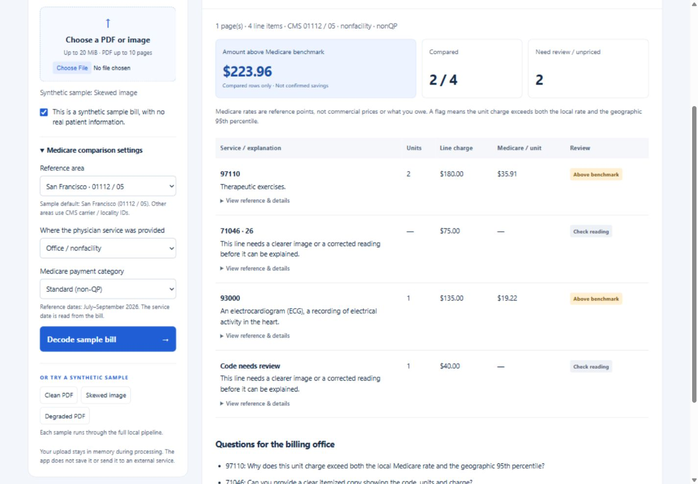
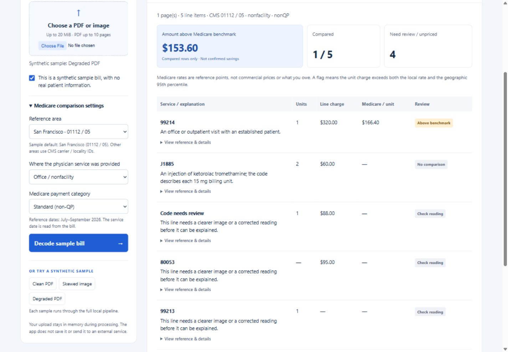
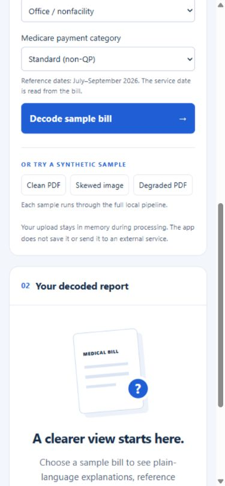

# Phase 5 checkpoint: local upload app

## What was built

`medbill/app.py` serves the plain HTML/CSS/JavaScript interface and a FastAPI upload endpoint. Uploaded bytes pass through actual OpenCV/Tesseract OCR, the existing parser, the real CMS comparison engine and the local explanation layer. No cached sample results enter this pipeline. The sample buttons fetch the synthetic fixture file and submit its actual bytes through the same endpoint as the file picker.

The results view includes service descriptions, quantities, line charges, per-unit Medicare amounts, flags, reading-review states, reference details and suggested billing-office questions. The summary uses the previously approved “amount above Medicare benchmark” wording. Basic summary/questions rendering belongs to this integrated report; Phase 6 still covers broader demo edge-case polish and persistence verification.

The user's no-third-party-API instruction remains in force. No hosted deployment, model, external font, analytics script or CDN is used. FastAPI's CDN-based documentation pages are disabled. Public-source/dependency downloads are setup tasks, not runtime API integrations.

## Run and test

From the project root, with the existing reference database and Tesseract installation:

```powershell
.\.venv\Scripts\python.exe -m pip install -r requirements.txt
.\.venv\Scripts\python.exe -m medbill.app
```

Open <http://127.0.0.1:8000>. To capture live HTTP results with the server running, in another terminal:

```powershell
.\.venv\Scripts\python.exe -m medbill.evaluate_api
.\.venv\Scripts\python.exe -m unittest discover -s tests -v
```

The live evaluator saves synthetic evidence to `docs/phase5/`; the server itself does not save reports. The app binds to `127.0.0.1:8000`, with access logging disabled. Run a single process using this entrypoint: the in-process concurrency gate is designed for a local demo, not a distributed deployment.

## Actual results

| Synthetic input | HTTP | OCR rows | Compared | Excluded | Positive benchmark difference |
| --- | ---: | ---: | ---: | ---: | ---: |
| Clean PDF | 200 | 4 | 3 | 1 | $384.44 |
| Skewed PNG | 200 | 4 | 2 | 2 | $223.96 |
| Degraded PDF | 200 | 5 | 1 | 4 | $153.60 |

All numerical summaries exactly match the saved Phase 3 results. Explanation coverage remains eight template rows and five OCR-review rows. These are partial benchmark differences, not recoverable savings, and three synthetic fixtures are not a general accuracy estimate.

The full suite passed **64 tests**, including real OCR requests for all three files. HTTP tests verify the local page/assets, 109 real locality pairs, required synthetic attestation, context validation, unsupported/empty/oversized uploads, cross-origin rejection and the sample allowlist. Evidence is in `docs/PHASE_5_TEST_OUTPUT.txt` and `docs/PHASE_5_API_OUTPUT.txt`. The installed Starlette version emits a deprecation notice about its httpx-based test client; the tests pass. No warnings are hidden.

Browser checks exercised all three sample buttons and the native file-picker flow with `01_clean.pdf` and synthetic attestation. Each displayed the corresponding measured report. Desktop and narrow-screen checks cover the two-column/stacked layout, with the line-item table horizontally scrollable on narrow screens. The saved screenshots show actual rendered results, not design mockups.








## API contract and data handling

- `GET /`: local upload/results page.
- `GET /api/localities`: actual carrier/locality pairs from SQLite.
- `GET /api/samples/{clean|skewed|degraded}`: allowlisted synthetic fixtures only.
- `POST /api/decode?synthetic=true&carrier=01112&locality=05&setting=nonfacility&category=nonQP`: raw file bytes with `Content-Type: application/octet-stream`. Returns the comparison report, explanation results and OCR summary as JSON.
- No server-side file path or filename parameter is accepted. The browser file-picker name stays in the page.
- Bytes are counted while streaming into bounded memory; no `UploadFile`, multipart parser or spool file is used. Existing 20-megapixel, ten-page and OCR per-page limits remain active.
- A single processing gate protects PDFium's thread-safety and limits concurrent work. A second job receives HTTP 429; retry when the current job finishes.
- Responses use `Cache-Control: no-store`. Browser text is inserted with `textContent`, not interpreted as HTML. There is no browser storage, server report cache, upload database or external request in the processing path.

This is not a forensic guarantee about operating-system paging or user-initiated screenshots. It describes application-managed persistence. Phase 6 will extend edge-case and no-persistence validation.

## Limits and deviations

The retained architecture is FastAPI plus plain HTML/JS as requested. The upload format uses a raw HTTP body to avoid framework temporary files. The app remains local, per the approved scope; it is not published to a cloud host.

Reference areas other than the demo default currently display CMS IDs, not a geographic search. The reference period and pricing limits are unchanged. Uncertain rows remain withheld and cannot be corrected inline. The runtime needs the previously built local database and Tesseract setup. Phase 6 demo polish and Phase 7 submission packaging remain pending.
