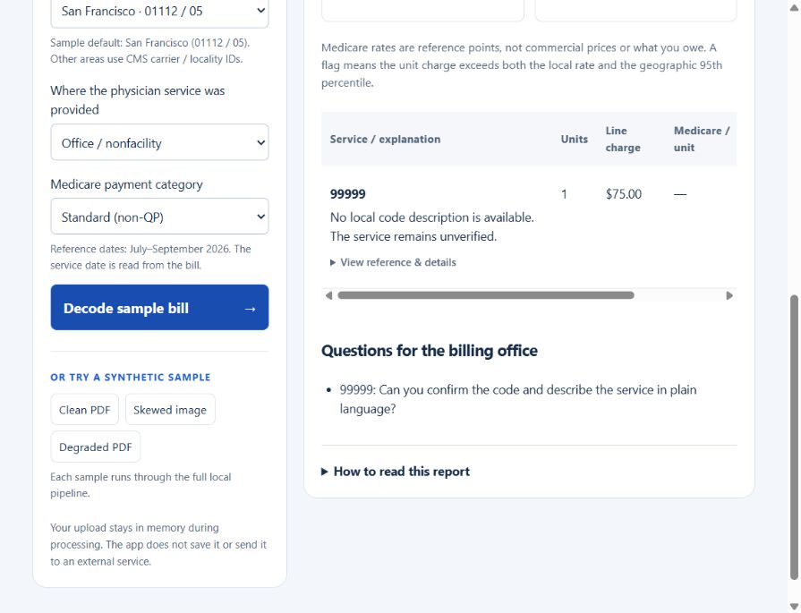
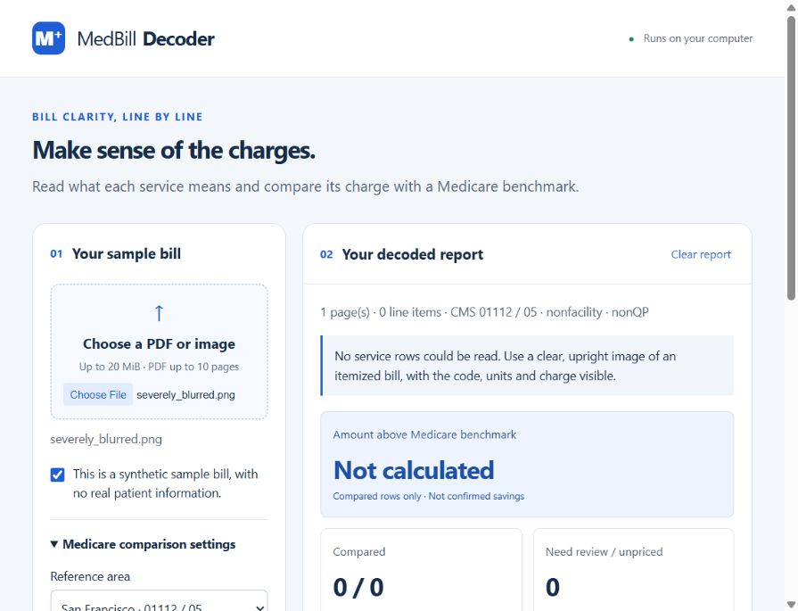

# Phase 6 checkpoint: demo polish and persistence verification

## Delivered behavior

The API now distinguishes no readable service rows, no comparable rows, partial comparisons and comparisons covering all extracted rows. The page shows practical guidance for each outcome. An unavailable total displays **Not calculated**, never $0.00. Partial comparisons explicitly state the count of rows included and excluded. Unknown codes and unsupported dates have distinct review labels.

The approved amount-above-Medicare-benchmark summary and billing-office questions remain visible. When nothing can be read, the question requests a clear itemized bill. Changing comparison settings clears the old report. Clear report also clears hidden summary text, rows, questions, error text and the selected file.

No model integration, fabricated benchmark or unapproved source change was introduced. The existing scope and statistical caveats remain unchanged.

## Actual edge-case results

The generator constructs synthetic images in memory. Codes/charges in these fixtures are fabricated inputs, not pricing references. The blurred fixture applies a 12-pixel Gaussian blur to a 200-DPI rendering of the existing clean sample. This tests severe information loss; it is not a calibrated blur detector or a general OCR accuracy study.

| Input | HTTP | Read rows | Compared | Outcome | Amount |
| --- | ---: | ---: | ---: | --- | --- |
| Blank image | 200 | 0 | 0 | No service rows | null / Not calculated |
| Severely blurred image | 200 | 0 | 0 | No service rows | null / Not calculated |
| Synthetic code 99999 | 200 | 1 | 0 | Unknown code | null / Not calculated |
| Service date 2025-01-15 | 200 | 1 | 0 | Unsupported date | null / Not calculated |

The unknown code was read as `99999`, matched no local description/rate, and received: “No local code description is available. The service remains unverified.” No meaning or price was guessed. All four cases have zero flags. A corrupt upload returns HTTP 422, and a subsequent valid request succeeds.

The full suite passes **68 tests**. New checks exercise actual OCR for the four edge fixtures, a streamed upload exceeding 20 MiB without Content-Length, rejection of a busy request before reading its body, and recovery after corrupt input. Prior tests still verify the three original sample summaries. JavaScript syntax and Git whitespace checks pass.

Browser file-picker tests confirm unknown-code and severe-blur messages, Not calculated, and clear-report behavior. Test evidence is in `docs/PHASE_6_EDGE_OUTPUT.json`, `docs/PHASE_6_TEST_OUTPUT.txt`, and `docs/phase6/`.





## Persistence audit: measured scope

`medbill/audit_persistence.py` runs in a fresh Python process against the real in-process HTTP app. It loads synthetic inputs before observation, redirects the working and temporary directories to an isolated scratch folder, enables Python audit-event observation only while requests are handled, and compares the reference database SHA-256 before and after. It does not replace OCR or intercept outputs with mocks.

Across three original samples, four edge fixtures and a corrupt upload, the passing run measured:

- **0 Python filesystem mutation events** during request handling.
- **0 socket connection events** during request handling.
- **0 files remaining** in the scratch working/temp directories after processing.
- **7 Tesseract processes**, each invoked with `stdin stdout -l eng --dpi 300 --psm 6 tsv`.
- **7 pipe write opens**, correctly identified as IPC pipes rather than disk files.
- **Unchanged reference database**, SHA-256 `2e5307e76def52d381adffb5d226af4606c608610229ab61aa77bb7106b19040`.
- `Cache-Control: no-store` on all eight responses.

The first audit implementation mishandled Windows subprocess metadata and stopped OCR; the corrected observational hook produced the passing evidence in `docs/PHASE_6_PERSISTENCE_AUDIT.json`. This was an audit-tool defect, not evidence of app disk persistence.

Application code uses no upload/report cache or browser storage; it passes raster images to Tesseract through pipes and opens SQLite read-only. Intentional synthetic fixture/report/screenshot files written by evaluators are test evidence, not runtime upload persistence.

**Limits:** Python audit hooks do not observe all native child-process system calls. The scratch-directory check finds retained artifacts, not every transient native write. This audit does not prove forensic erasure from operating-system paging, crash dumps or user-created screenshots. It supports the scoped claim that the application has no implemented upload persistence and that no disk artifacts were observed in the measured processing paths. Real patient information remains prohibited.

## Reproduce

```powershell
.\.venv\Scripts\python.exe -m medbill.app
# In another terminal, with the local server running:
.\.venv\Scripts\python.exe -m medbill.evaluate_edges
.\.venv\Scripts\python.exe -m medbill.audit_persistence
.\.venv\Scripts\python.exe -m unittest discover -s tests -v
```

The evaluator deliberately writes synthetic evidence files; the server does not. Phase 7 submission packaging, the Devpost draft and video script await approval.
